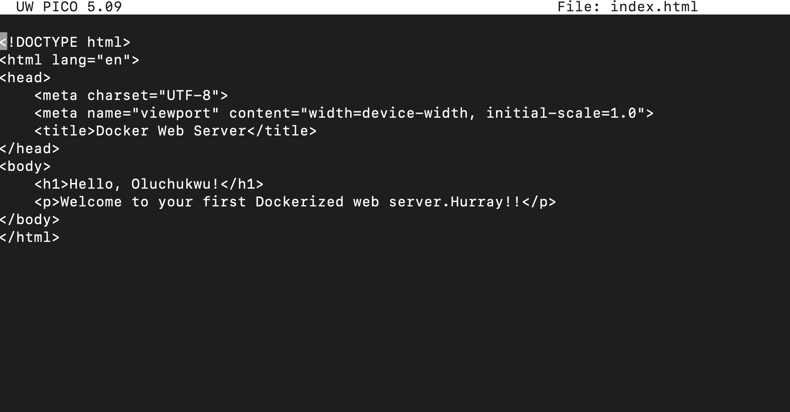

# NGINX WEB SERVER WITH DOCKER.

Here's a straightforward guide on creating a Nginx web server with Docker. This is ideal for beginners looking to understand the basics of Docker and web servers.

#

Building a Ngnix Web Server with Docker
If you’re venturing into DevOps, understanding Docker is essential. Docker lets you package applications and their dependencies into a single container, allowing for quick deployment and consistency across different environments. Here’s a step-by-step guide to creating a nginx web server in Docker.

#

Prerequisites
Before we start, make sure you have:

- Docker installed on your machine (check installation by running docker --version).
- Basic understanding of web servers (HTML/CSS is a plus).

#

**Step 1: Write a Simple HTML File.**
Let's create a simple webpage to serve as our content.

**1. Create a directory for your project:**

`mkdir docker-project-1`

`cd docker-project-1`

**2. Inside this directory, create an `index.html` file**

`touch index.html`

`nano index.html`

This file will be our web server's home page.

#

**Step 2: Create a Dockerfile:**
A Dockerfile is a script that contains instructions for building a Docker image. This file will tell Docker how to set up our web server environment.

Inside your project directory, create a file named `Dockerfile`.

Add the below content to the Dockerfile:

*Here's a breakdown of each line in the Dockerfile:*

- FROM nginx:alpine: This line tells Docker to use the official Nginx image, which includes a lightweight Nginx server built on the Alpine Linux distribution.
- COPY `index.html /usr/share/nginx/html/`: This line copies our `index.html` file into the default directory Nginx serves files from.
- EXPOSE 80: This exposes `port 80` on the container, allowing us to access the web server.

#

**Step 3: Build the Docker Image:**
With the Dockerfile and `index.html` file in place, let's build the Docker image.

Run the following command in the terminal:

`docker build -t my-ngix-app .`

*Here’s what this command does:*

- `docker build`: Builds a Docker image from a Dockerfile.
- `-t my-nginx-app`: Tags the image with a name, my-nginx-app, making it easier to refer to later.
- `.`: Tells Docker to use the current directory as the build context (this is where Docker will look for the Dockerfile).

  View the images with the below command:

  `docker images`

Docker will pull the Nginx image if you don't have it already and then build your custom image with the specified configuration.

#

**Step 4: Run the Docker Container.**

Once the image is ready, you can run it as a container.

Run the following command:

`docker run -d -p 8080:80 my-nginx-app`

This command does a few things:

- `docker run`: Creates and starts a new container.
- `-d`: Runs the container in detached mode, so it runs in the background.
- `-p 8080:80`: Maps port 8080 on your local machine to port 80 on the container (where Nginx is listening).
- `my-nginx-app`: Specifies the image to use.

#

**Step 5: Test Your Web Server.**

Now, open a web browser and go to `http://localhost:8080`. You should see the "Hello, Oluchukwu!" message from your index.html file. 

**Congratulations—you’ve successfully set up a ngnix web server in Docker!**

#

**Step 6: Stopping the Container.**
When you’re done, you can stop the container with the following command:

`docker ps -a`  # Find the container ID if you need to

`docker stop <container_id>`

Remove the container with the below command:

`docker rm <container_id>`

Then, remove the image with the below command:

`docker rmi <images id>`

#

**Wrapping Up.**

You now have a nginx web server running in Docker! This setup is easy to expand for more complex web applications by:

- Using different web servers or application stacks.
- Incorporating dynamic content with languages like Python, Node.js, or PHP.
- Adding volume mounting to manage files outside the container.
  
*Containers offer a consistent, isolated environment, making development and deployment easier. Try experimenting with other configurations, and get comfortable with Docker’s 
 potential in DevOps.*

#

**Final Thoughts:**

Docker is a powerful tool for simplifying application deployment. By understanding how to containerize even the simplest applications, you're building a foundation that will help you in any DevOps or cloud-based role.

